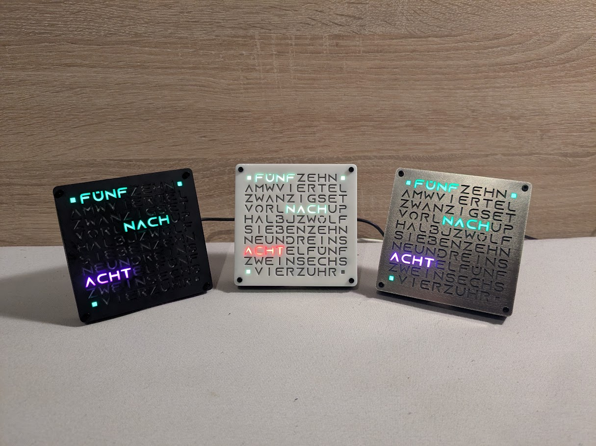
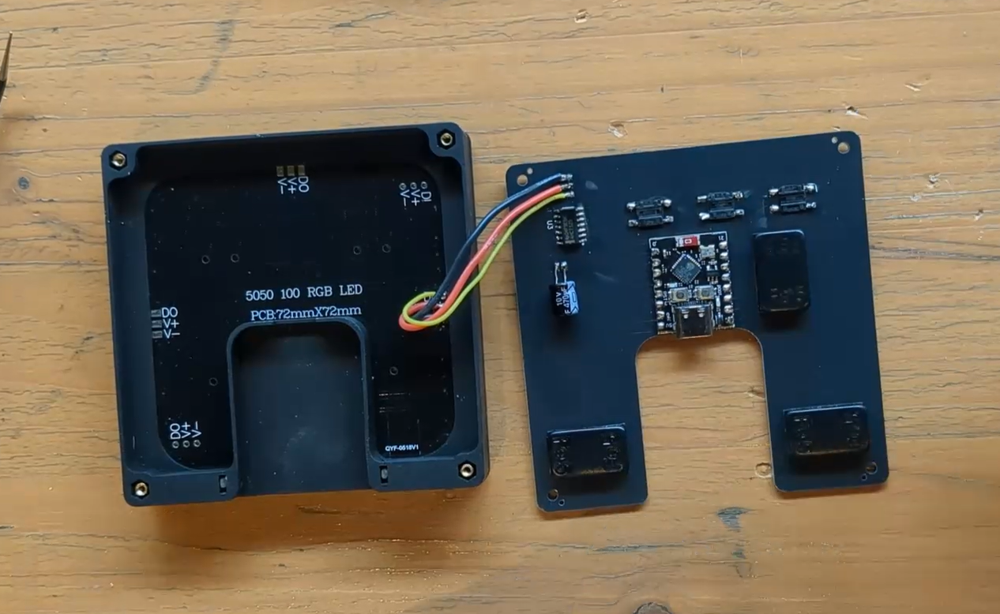
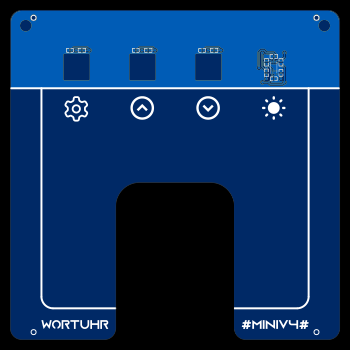
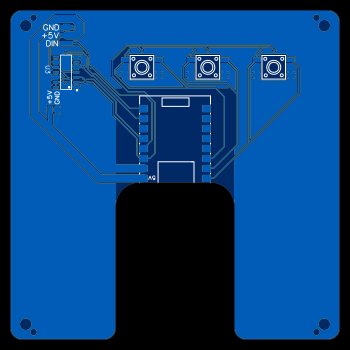
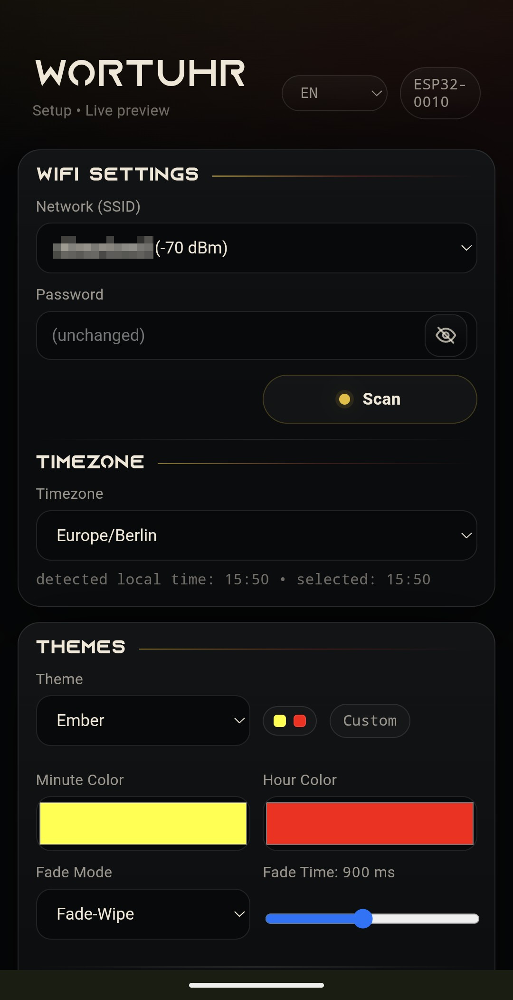
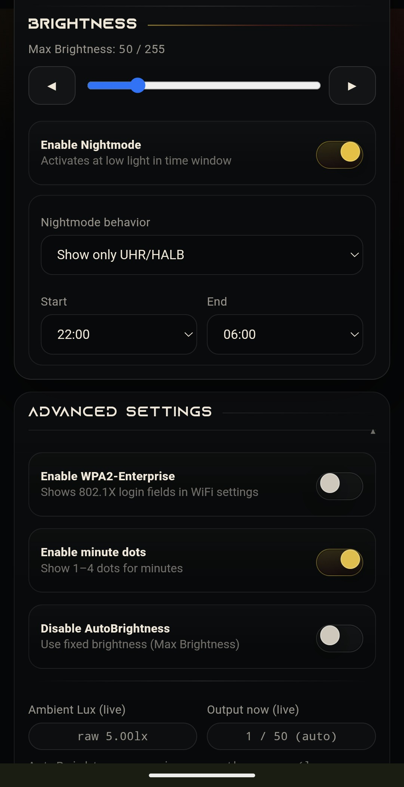

# WordClock Mini V4

A fully custom ESP32-C3 based word clock designed and developed from scratch, including firmware, PCB design, web configuration interface, and enclosure integration.

The clock displays the current time using illuminated words in a custom designed font instead of digits and automatically synchronizes with internet time servers. Configuration is handled through a built-in responsive web interface without requiring firmware modifications.

The clock comes in 3 color variants: white, black and stainless steel

---

## Demo Videos

### Quick Demo

### Making Of

---

## Gallery

### Custom PCB

### Built-in Configuration Interface

---

## Design Goals

The project was designed with the following goals in mind:

- Compact desktop-sized form factor
- Simple Wi-Fi based configuration / also support WPA-Enterprise
- Automatic brightness adjustment
- No dedicated mobile application required
- Wireless firmware updates
- High-quality visual appearance
- Fully custom hardware platform
- Custom packaging and user manual

---

## Features

* ESP32-C3 based architecture
* Custom PCB design
* Wi-Fi provisioning and configuration portal
* NTP time synchronization
* OTA firmware updates
* Ambient light sensing with automatic brightness control
* Multiple color themes
* Smooth LED transition animations
* Night mode
* Responsive web configuration interface

---

## Mechanical Design

The front face is manufactured using a custom stainless steel SMT stencil,
creating crisp and highly accurate lettering while maintaining a premium appearance.

The enclosure consists of multiple custom-designed 3D printed parts,
including the front frame, PCB chamber and mounting hardware.

A frosted diffuser layer is used to achieve uniform illumination
and eliminate visible LED hotspots.

---

## Hardware

| Component | Purpose |
|------------|------------|
| ESP32-C3 | Main microcontroller |
| WS2812 LED Matrix | Time display |
| BH1750 | Ambient light sensing |
| SN74AHCT125 | Level shifting for LED data signal |
| Custom PCB | Hardware integration |
| Frosted Diffuser | Uniform light distribution |
| 3D Printed Enclosure | Mechanical assembly |
| USB-C | Power and firmware flashing |
| Tactile Buttons | Setup and user interaction |

---

## License

This project is released under the MIT License.